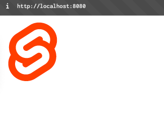
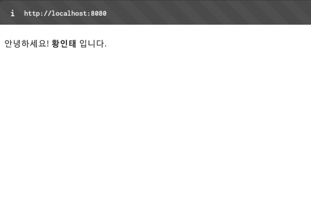

# 4. 상탯값 관리


웹 프론트엔드 개발에서는 component뿐만 아니라 state 역시 매우 중요한 개념이다.
state는 component가 표현하는 모든 데이터를 의미한다.

props와 차이는 props는 부모 component가 자식 component에 내려주는 값이고, state는 해당 component가 자신이 사용할 값을 관리하는 것

svelte는 JS 변수처럼 사용하고, 마크업 영역에서는 중괄호({})를 사용하여 state를 표현한다.

#### 4.1.1 텍스트 콘텐츠로 처리
```svelte
// State 기본 문법
<script>
	let 상태변수 = 값
</script>

<태그> { 상태변수 } </태그>
```

#### 4.1.2 태그 속성값에 처리
```svelte
<script>
	let url = 'https://svelte.dev/favicon.png'
</script>


```

```svelte
// State 변수를 속성명과 같게 처리
<script>
	let src = 'https://svelte.dev/favicon.png'
</script>


```


#### 4.1.3 상탯값의 태그 문자열 인식
@html 뒤에 상태변수명을 붙이면 태그로 반환

```svelte
<script>  
    let str = '안녕하세요! <strong>황인태</strong> 입니다.'  
</script>  
  
<p> {@html str} </p>
```


## 4.2 클릭 이벤트를 이용한 상탯값 변경
```svelte
<script>  
    let num = 0;  
  
    const increaseNumber = () => num++;  
    const decreaseNumber = () => num--;  
</script>  
  
<button on:click={increaseNumber}>+</button>  
<button on:click={decreaseNumber}>-</button>  
<hr/>  
<h1> 클릭횟수 : {num} </h1>
```

## 4.3 객체 속성을 상탯값으로 활용
```svelte
<script>  
    let language = {  
        name: '스벨트',  
        release: 2016,  
        src: 'https://svelte.dev/favicon.png'  
    }  
</script>  
  
<h3>이름: {language.name}</h3>  
<h3>배포 연도: {language.release} 년</h3>  

```

```diff
<script>  
    let language = {  
        name: '스벨트',  
        release: 2016,  
        src: 'https://svelte.dev/favicon.png'  
    }  

+	let {name, release, src} = laguage;
</script>  
  
- <h3>이름: {language.name}</h3>  
- <h3>배포 연도: {language.release} 년</h3>  
- 

+ <h3>이름: {name}</h3>  
+ <h3>배포 연도: {release} 년</h3>  
+ 
```

## 4.4 객체로 이루어진 배열을 이용하여 상탯값 표시
```java
<script>  
    let langs = [  
        {  
            name: '스벨트',  
            release: 2016,  
            src: 'https://svelte.dev/favicon.png'  
        }, {  
            name: '리액트',  
            release: 2013,  
            src: 'https://ko.react.dev/favicon-32x32.png'  
        }, {  
            name: 'Vue.js',  
            release: 2013,  
            src: 'https://vuejs.org/logo.svg'  
        },  
    ]  
</script>  
  
{#each langs as lang}  
    <h3>이름: {lang.name}</h3>  
    <h3>배포 연도: {lang.release} 년</h3>  
      
    <hr />
{/each}
```

